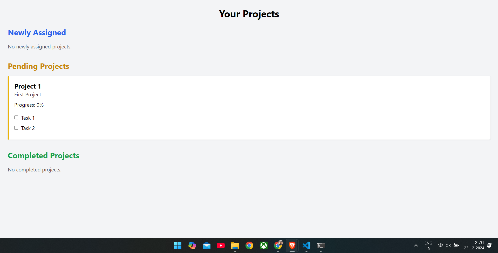

LogIn screen

Register Screen 
Role based authentication usr or admin

Add Project onl admins are allowed to add projects

Adding project 
Admin can search for a particular user

Usr interface for normal user with newly Project Assigned

Pending Projects

Pending Projects with some tasks completed

completed Project

Completed Projects with newly Assigned Projects

All projects including completed newly assigned and Pending 

Flow 
1) Admin add project and assign to a user. Project will have subtasks and each subtasks will have some score when user completes that subtask score added to the user . For critical tasks set by the admin usr will get extra points.
2) User can see the Projects assigned too them as newly assigned projects
3) When user accepts the Project it will come under pending.
4) User can complete tasks and track the progress as tasks completed one by one.
5) When all the tasks in a project completed the Project will be marked as completed project.